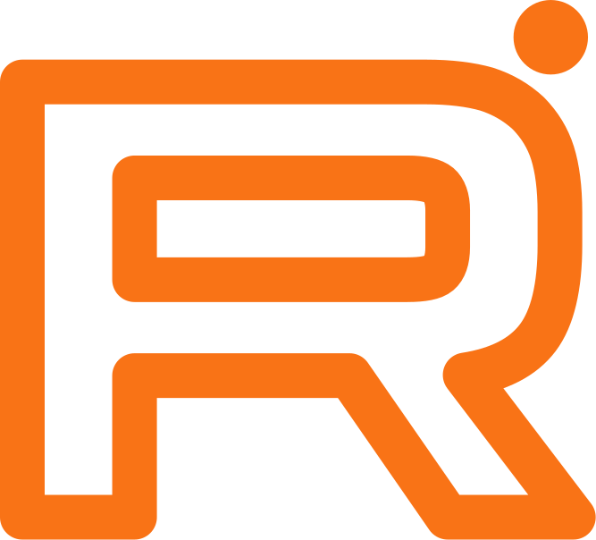

# Привет, Я Михаил Дьяченко (ПрограМишка) 👋

**Ведущий разработчик ПО • Архитектор • Backend Python Developer**

Я специализируюсь на создании масштабируемых и надёжных веб-сервисов, автоматизации и оптимизации бизнес-процессов с использованием ИИ. Помогаю предпринимателям строить живые инженерные системы.

> **Итог моей работы:** бизнес работает проще, растет быстрее и зарабатывает больше. 🚀

---

### 🛠 Технический стек

- **Backend:** Python, FastAPI, Django, Rust
- **Архитектура & Инфраструктура:** Kubernetes, Kafka, WebSocket, REST API, JSON-RPC, Microservices
- **Video & ML:** GStreamer, YOLO, Computer Vision, Video Analytics
- **Frontend:** React, TypeScript

---

### 🚀 Ключевые проекты

- **Универсальная платформа видеоаналитики:** Обработка высоконагруженных видеопотоков, интеграция ML-моделей (CV), low-code инструмент для настройки сценариев.
- **Система детекции объектов в небе:** Real-time анализ видеопотоков (YOLO, Kafka, WebSocket) с минимальной задержкой.
- **Предотвращение списываний на экзаменах:** Интеллектуальный мониторинг сессий (Rust + GStreamer + Django).
- **Единая аналитическая платформа для ритейлеров:** Сбор и анализ данных с Ozon, Wildberries, Яндекс.Маркет (FastAPI + Django).
- **No-Code платформа для техподдержки:** Оркестрация и мониторинг бизнес-процессов.

---

### 🏆 Достижения и факты

- **20+ лет** в коммерческой разработке (в IT с 1999 года).
- **Спикер** на профессиональных конференциях (архитектура видеопотоков, Python для промышленного оборудования, отказоустойчивое ПО).
- **Технический писатель** (популярные статьи на Хабре о Multiprocessing/Threading в Python).
- **Ментор и Team Lead:** Выстраиваю обучение, руковожу проектами и помогаю разработчикам расти до уровня Senior/Lead.

---

### 📫 Как со мной связаться

  
  
  
  
  
  
  
  

<!--
Примечание:
Чтобы иконки отображались корректно, создайте папку `icons` в корне вашего репозитория `programishka/programishka`
и загрузите туда соответствующие SVG файлы, которые можно скачать ниже.
-->
